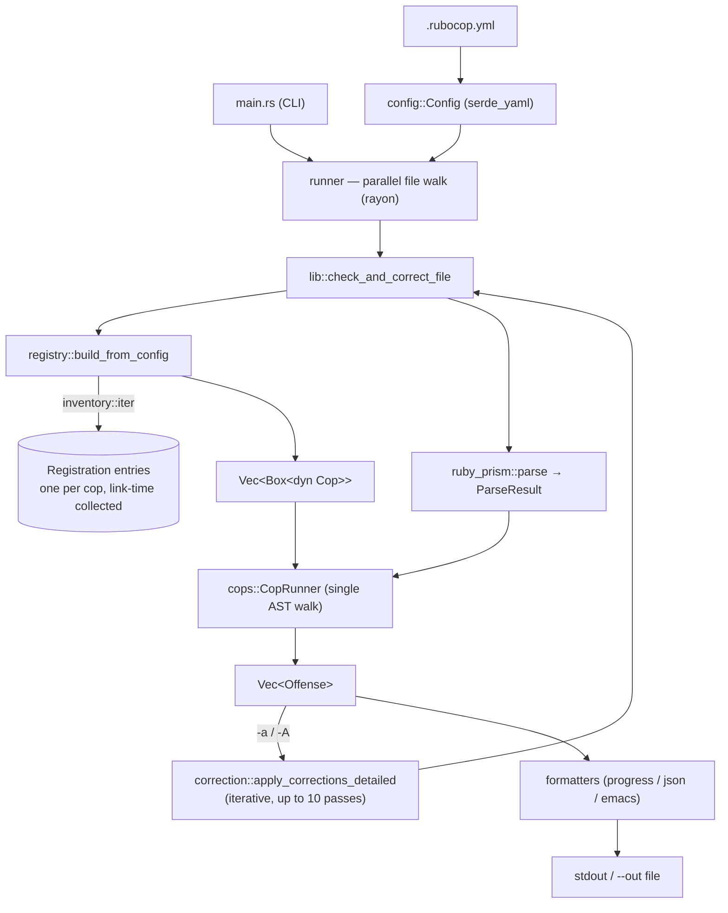
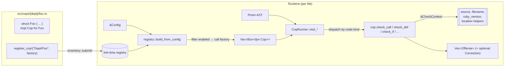
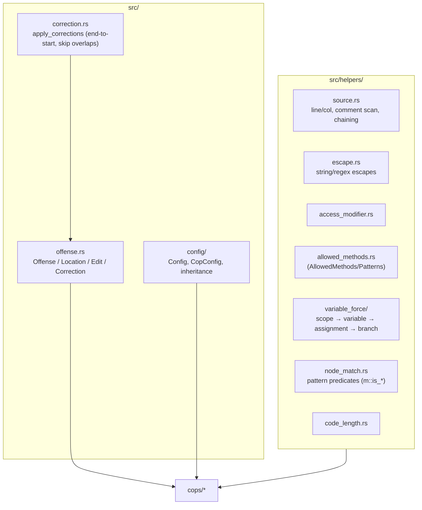
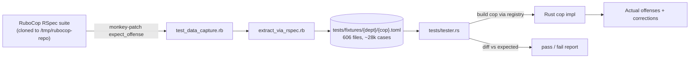

# Architecture

High-level map of how `ruby-fast-cop` is wired. Complements `CLAUDE.md` (which covers conventions) and `COPS.md` (status).

## System overview

End-to-end flow from a file on disk to offenses (optionally autocorrected) on stdout.



Key points:
- **Single parse per file** — Prism runs once, all cops share the `ParseResult`.
- **Single AST walk per file** — `CopRunner` implements `ruby_prism::Visit` and fans each node out to every registered cop's relevant `check_*` method. No per-cop traversal.
- **Autocorrect is a fixpoint loop** — parse → lint → apply → repeat until stable, cycle-detected, or 10 iterations (Ruff model, not RuboCop's 200).
- **Parallelism is at file granularity** — rayon splits files across threads; a single file is checked serially.

## Cop implementation architecture

How one cop goes from source file to being invoked during an AST walk.



### The `Cop` trait (current surface)

Declared in `src/cops/mod.rs`. Each cop overrides only the `check_*` methods relevant to its node kinds — the rest default to empty `Vec<Offense>`. `CopRunner` dispatches once per node per cop during the shared walk.

Typical shapes:
- **Pattern cop** (`Style/RedundantFreeze`) — implements `check_call` only, matches method name, returns offense.
- **Scope-aware cop** (`Lint/UselessAssignment`) — implements `check_program`, spins up its own inner `Visit` walker with scope/branch state (uses `helpers::variable_force`).
- **Whole-file cop** (`Layout/LineLength`) — implements `check_program`, scans source by line rather than AST.

### Registration (`inventory`-backed)

```rust
// At the bottom of every cop file:
crate::register_cop!("Style/RedundantFreeze", |cfg| {
    let frozen_by_default = cfg.get_cop_config("Style/RedundantFreeze")
        .and_then(|c| c.raw.get("AllCopsStringLiteralsFrozenByDefault"))
        .and_then(|v| v.as_bool())
        .unwrap_or(false);
    Some(Box::new(RedundantFreeze::with_config(frozen_by_default)))
});
```

`inventory::collect!(Registration)` in `src/cops/registry.rs` harvests every `submit!` at link time. `build_from_config` iterates, filters via `config.is_cop_enabled(name)`, and calls the factory. Three public entry points:

| Function | Use |
|---|---|
| `registry::build_from_config(&Config)` | Production — only enabled cops, config-applied |
| `registry::build_one(name, &Config)` | Test/--only harness — single cop |
| `registry::all_with_defaults()` | `cops::all()` — every cop with `Config::default()` |

Adding a cop touches exactly one file (`src/cops/{dept}/{name}.rs`) + one `pub use` in `{dept}/mod.rs` + flipping `implemented = true` in the TOML fixture. No `lib.rs` or `mod.rs::all()` edits.

## Shared infrastructure

Keep these mental models when reading/writing cops:



- **`CheckContext`** — the single thing every `check_*` method gets. Holds `source`, `filename`, `target_ruby_version`, and location helpers (`line_of`, `col_of`, `line_start`, `offense_with_range`). Mirrors RuboCop's `RangeHelp` / `Alignment` mixins.
- **`helpers::variable_force/`** — port of RuboCop's `Cop::VariableForce` (scope analyzer for useless/shadowed/unused assignment cops). Mirrors Ruby module file layout.
- **`helpers::node_match`** (`m::*` predicates) — small pattern helpers translating RuboCop's `def_node_matcher` patterns into Rust.

## Testing pipeline



One TOML file per cop. `tester.rs` is cop-agnostic — it discovers fixtures, builds cops by name via `registry::build_one`, diffs offenses + corrected source.

## Where this document should be updated

Any time the following change, update this file:
- New top-level module in `src/` or department in `src/cops/`
- New trait/type in the public runtime surface (`Cop`, `CheckContext`, `Offense`, `Correction`)
- Registration mechanism (currently `inventory` + `register_cop!`)
- Autocorrect pipeline shape (iteration count, conflict strategy, entry points)
- Shared helper added to `src/helpers/` that multiple cops depend on
- Testing pipeline (fixture format, tester dispatch, extraction scripts)

If a change only touches a single cop's internals, it does **not** belong here — document it inline or in `CLAUDE.md`.
